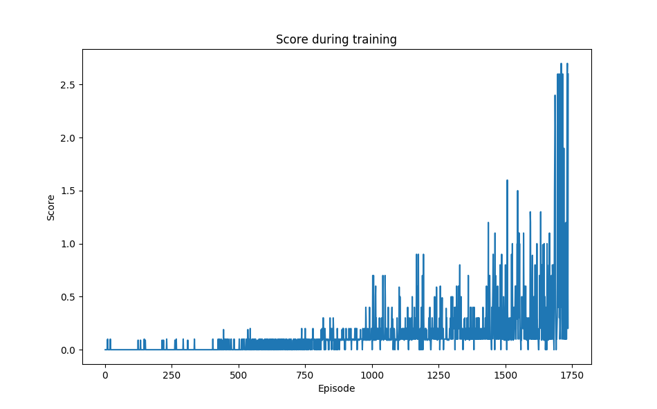
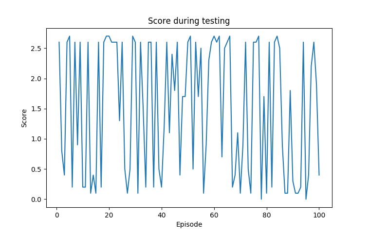

# Report
The scope of this report is to describe the learning algorithm, the hyperparameters and the performance of the agent used to solve the tennis environment.

# Learning algorithm and hyper parameters
The symmetrie in this collaboritve environment allows it to reduces this two agent problem to a one agent problem, i.e. an agent that plays with two rackets. The agent observes a concatenation of the two rackets observations and outputs an action for both rackets. Therefore, the DDPG algorithm as described in the [previous project](https://github.com/marcomuc/drlnd-p2-cc/blob/master/Report.md) can be used again. An informal search process was used to optimize the number of hidden layers for the actor and the critic networks. Both networks use two hidden layers with *200* and *150* units.

To avoid overfitting, the training of the agent was stopped when it achieved an average score over the last 100 episodes greater than *0.66*, which could be achieved after *1735* episodes. The score during training is shown in this plot:

The number of episodes to solve this environement is about one order of magnitude larger compared to previous project. However, in the reacher_v2 enviroment of the previous project, 20 parallel agents where used which also produce more roughly more training data by the same factor.

# Performance of the agent
In a test run consisting of 100 episodes, the agent achieved an average score of *1.5* (with a standard deviation of *1.1*) thus succesfully achieving the required performance. The following plots show the score of the agent for each test episode:

# Outlook
Futur work should implement den the [MADDPG algorithm](https://blog.openai.com/learning-to-cooperate-compete-and-communicate/) which is supposed to be more stable and can be used also in non-collaborative i.e. competitive enviroments.
